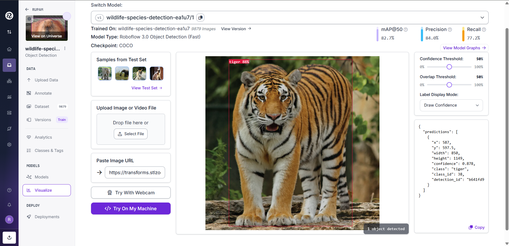
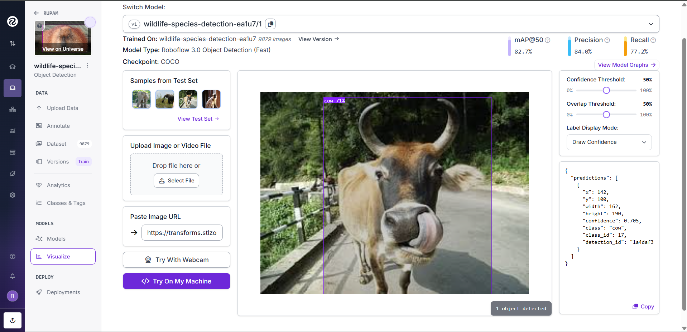

# AI-Based Wildlife Species Detection 🐾

This project implements an **AI-based wildlife species detection system** using **YOLOv8** and **Roboflow**.  
The goal is to automatically detect and classify wildlife species from images, making it suitable for **camera trap analysis, wildlife monitoring, and conservation research**.

---

## 📌 Project Overview

- **Task**: Multi-class Object Detection  
- **Model**: YOLOv8  
- **Framework**: Ultralytics YOLO  
- **Dataset Tool**: Roboflow  
- **Use Case**: Wildlife monitoring & conservation  
- **Project Type**: Final Year / Research / Portfolio Project  

---

## 🗂 Dataset

- The dataset was created and annotated using **Roboflow**.
- It contains **multiple wildlife species and humans**.
- Images are split into **train / validation / test** sets.

⚠️ **Note**  
Due to GitHub size limitations, raw images are **not included** in this repository.  
Only the dataset structure and labels are provided as `dataset.zip`.

### 📥 Dataset Access (Roboflow – Private)

- Raw images are securely hosted on Roboflow
- This repository includes only dataset structure and labels (`dataset.zip`)
- The full dataset can be downloaded programmatically using the **Roboflow API** with a valid API key

---

## 🧠 Model Details

- **Architecture**: YOLOv8  
- **Training Platform**: Roboflow Hosted Training + Ultralytics  
- **Model Type**: Object Detection (Fast)

### 📊 Performance Metrics

| Metric | Value |
|------|------|
| **mAP@50** | 82.7% |
| **Precision** | 84.0% |
| **Recall** | 77.2% |

---

## 🔍 Model Inference Results

The model was trained and evaluated using Roboflow’s hosted training pipeline.  
Due to plan limitations, trained weights were not exported.

Inference results were generated using Roboflow’s visualization tools.

### Sample Detection Outputs




These results demonstrate accurate detection of wildlife species and humans in camera-trap-style images.

---

## ⚙️ Setup Instructions

### Clone the Repository

```bash
git clone https://github.com/Rupam160/AI-Based-Wildlife-Species-Detection.git
cd AI-Based-Wildlife-Species-Detection
